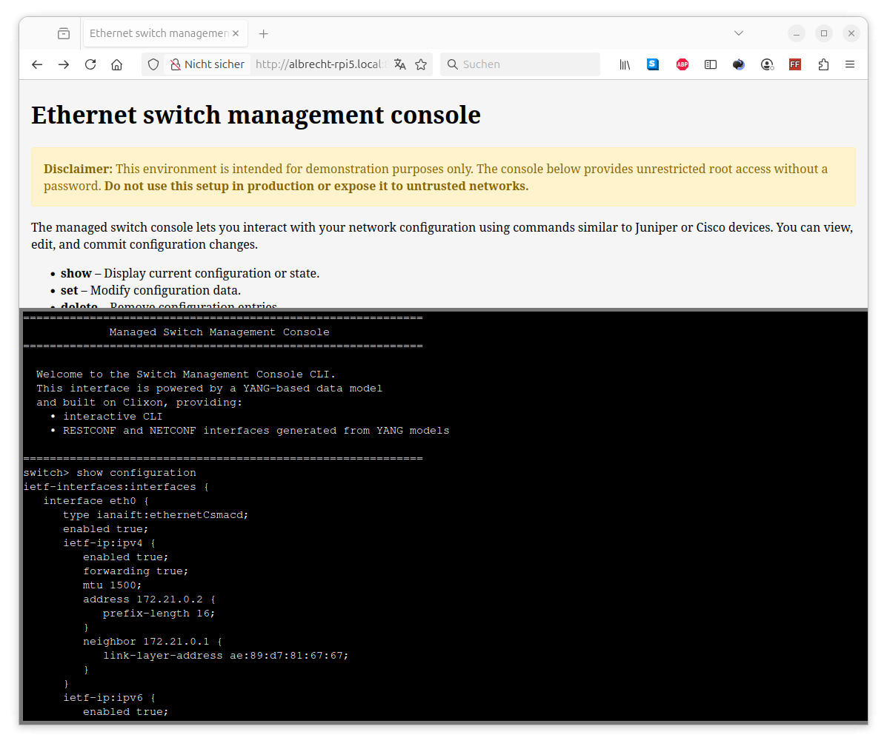

# Managed Switch CLI/netconf/restconf Docker container based on YANG models

This project provides a Docker container for managing network switches using CLI, netconf, and restconf interfaces, leveraging YANG models for configuration and state data. It is built on top of the clixon framework and utilizes open-source YANG models from the YangModels and OpenConfig projects. The container aims to simplify deployment and integration of network management tools in a consistent, reproducible environment.

While this project is designed to be as generic as possible, development and testing have primarily focused on the [open source managed switch hardware](https://github.com/AlbrechtL/rpi-managed-switch-4-port). Compatibility with other hardware platforms may require additional adaptation or testing.

## Usage

Build container

```bash
$ docker compose build
```

Run container

```bash
$ docker compose up
```

See also [`docker-compose.yml`](https://github.com/AlbrechtL/managed-switch-yang-netconf-cli-docker/blob/main/docker-compose.yml).


### CLI

**Web browser**
Simply open a web browser and navigate to `http://<host IP>:<host port>/` e.g. `http://localhost:8888/`



**SSH**

```bash
$ ssh cli@<host IP> -p <host port> 
```
e.g. 

```bash
$ ssh cli@localhost -p 2222
============================================================
             Managed Switch Management Console
============================================================

  Welcome to the Switch Management Console CLI.
  This interface is powered by a YANG-based data model
  and built on Clixon, providing:
    • interactive CLI
    • RESTCONF and NETCONF interfaces generated from YANG models

============================================================
switch>
```

### RESTCONF

```bash
$ curl -X GET http://<host ip>:<host port>/rest/restconf/data/<command>
```

e.g. getting port info

```bash
$ curl -X GET http://localhost:8888/rest/restconf/data/ietf-interfaces:interfaces
{
  "ietf-interfaces:interfaces": {
    "interface": [
      {
        "name": "eth0",
        "type": "iana-if-type:ethernetCsmacd",
        "enabled": true,
        "oper-status": "up",
        "phys-address": "82:09:89:a4:02:6a",
        "statistics": {
          "discontinuity-time": "2025-09-15T19:51:07+00:00",
          "in-octets": "2704",
          "in-unicast-pkts": "2704",
          "in-multicast-pkts": "0",
          "in-discards": 0,
          "in-errors": 0,
          "out-octets": "308",
          "out-unicast-pkts": "308",
          "out-discards": 0,
          "out-errors": 0
        },
        [...]
      },
      {
        "name": "lo",
        "type": "iana-if-type:softwareLoopback",
        "enabled": true,
        "oper-status": "up",
        "phys-address": "00:00:00:00:00:00",
        "statistics": {
          "discontinuity-time": "2025-09-15T19:51:07+00:00",
          "in-octets": "468",
          "in-unicast-pkts": "468",
          "in-multicast-pkts": "0",
          "in-discards": 0,
          "in-errors": 0,
          "out-octets": "468",
          "out-unicast-pkts": "468",
          "out-discards": 0,
          "out-errors": 0
        },
        [...]
    ]
  }
}
```
### NETCONF

```bash
$ ssh -s clicon@<host IP> -p <host port> netconf
```
e.g. 

```bash
$ ssh -s clicon@localhost -p 2222 netconf

#935
<hello xmlns="urn:ietf:params:xml:ns:netconf:base:1.0"><capabilities><capability>urn:ietf:params:netconf:base:1.1</capability><capability>urn:ietf:params:netconf:base:1.0</capability><capability>urn:ietf:params:netconf:capability:yang-library:1.1?revision=2019-01-04&amp;module-set-id=0</capability><capability>urn:ietf:params:netconf:capability:candidate:1.0</capability><capability>urn:ietf:params:netconf:capability:validate:1.1</capability><capability>urn:ietf:params:netconf:capability:startup:1.0</capability><capability>urn:ietf:params:netconf:capability:xpath:1.0</capability><capability>urn:ietf:params:netconf:capability:with-defaults:1.0?basic-mode=explicit&amp;also-supported=report-all,trim,report-all-tagged</capability><capability>urn:ietf:params:netconf:capability:notification:1.0</capability><capability>urn:ietf:params:xml:ns:yang:ietf-netconf-monitoring</capability></capabilities><session-id>2</session-id></hello>
##
```

## Acknowledgements

I would like to thank the following open-source projects. Without these great works, this open-source switch would not be possible:  
* [YangModels](https://github.com/YangModels/yang)
* [OpenConfig](https://github.com/openconfig/public)
* [YANG catalog](https://www.yangcatalog.org/YANG-modules/)
* [clixon](https://www.clicon.org/)  
* [clixon backend helper](https://github.com/MontaVista-OpenSourceTechnology/clixon-backend-helper)  
* [WebSSH](https://github.com/huashengdun/webssh)  


## Security notice
1. **Unencrypted Communication Between Web Frontend and Web Backend:**
The communication between the frontend and backend occurs over an unencrypted HTTP channel. This exposes sensitive data to potential attackers and manipulation, especially on untrusted networks. To enhance security, it is highly recommended to use a reverse proxy to upgrade the channel to HTTPS (TLS encryption) to secure communication and prevent unauthorized access.

2. **Lack of User Management in the Web Interface:**
The web interface does not include built-in user management. Any user who can access the web interface automatically control to Ethernet interface configuration. To enhance security, it is strongly recommended to place the web interface behind a reverse proxy with proper user authentication and access controls.

3. **Privileged Mode Requirement for this Container:**
The container must run in privileged mode to ensure exclusive access to the host's Ethernet interfaces. This is necessary for proper operation but comes with inherent security considerations.

**Disclaimer:** This software container is a proof of concept and has not undergone comprehensive cybersecurity assessments. Users are cautioned that potential vulnerabilities may exist, posing risks to system security and data integrity. By deploying or using this container, users accept the associated risks, and the developers disclaim any responsibility for security incidents or data breaches. A thorough security evaluation, including penetration testing and compliance checks, is strongly advised before production deployment. The software is provided without warranty, and users are encouraged to provide feedback for collaborative efforts in addressing security concerns. Users acknowledge reading and understanding this disclaimer, assuming responsibility for ensuring their environment's security.
